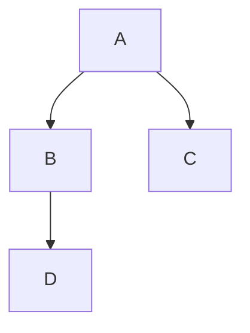

# Learning Git and Github

Version control is an essential skill for developers to master, and Git is by far the most popular version control system on the web. In this fast-paced course, author Ray Villalobos shows you how to install Git and use the fundamental commands you need to work with Git projects: moving files, managing logs, and working with branches.

Plus, you'll learn how to work with the popular GitHub website to explore existing projects, clone them to your local hard drive, and use them as templates for your new projects.


------------------
# Markdown Cheat Sheet

Thanks for visiting [The Markdown Guide](https://www.markdownguide.org)!

This Markdown cheat sheet provides a quick overview of all the Markdown syntax elements. It can’t cover every edge case, so if you need more information about any of these elements, refer to the reference guides for [basic syntax](https://www.markdownguide.org/basic-syntax/) and [extended syntax](https://www.markdownguide.org/extended-syntax/).


## Basic Syntax

These are the elements outlined in John Gruber’s original design document. All Markdown applications support these elements.

### Heading

# H1
## H2
### H3

### Bold

**bold text**

### Italic

*italicized text*

### Blockquote

> blockquote

### Ordered List

1. First item
2. Second item
3. Third item

### Unordered List

- First item
- Second item
- Third item

### Code

`code`

### Horizontal Rule

---

### Link

[Markdown Guide](https://www.markdownguide.org)

### Image


## Extended Syntax

These elements extend the basic syntax by adding additional features. Not all Markdown applications support these elements.

### Table

| Syntax | Description |
| ----------- | ----------- |
| Header | Title |
| Paragraph | Text |

### Fenced Code Block

```
{
  "firstName": "John",
  "lastName": "Smith",
  "age": 25
}
```

# mermaid



### collapsed html

<details>
  <summary>collapsed</summary>

# Header
This is the copy for the collapsed text.
</details>


> [!NOTE]
> A note

> [!IMPORTANT]
> Important

> [!WARNING]
> Warning

### Footnote

Here's a sentence with a footnote. [^1]

[^1]: This is the footnote.

### Heading ID

### My Great Heading {#custom-id}

### Definition List

term
: definition

### Strikethrough

~~The world is flat.~~

### Task List

- [x] Write the press release
- [ ] Update the website
- [ ] Contact the media

### Emoji

That is so funny! :joy:

(See also [Copying and Pasting Emoji](https://www.markdownguide.org/extended-syntax/#copying-and-pasting-emoji))

### Highlight

I need to highlight these ==very important words==.

### Subscript

H~2~O

### Superscript

X^2^
